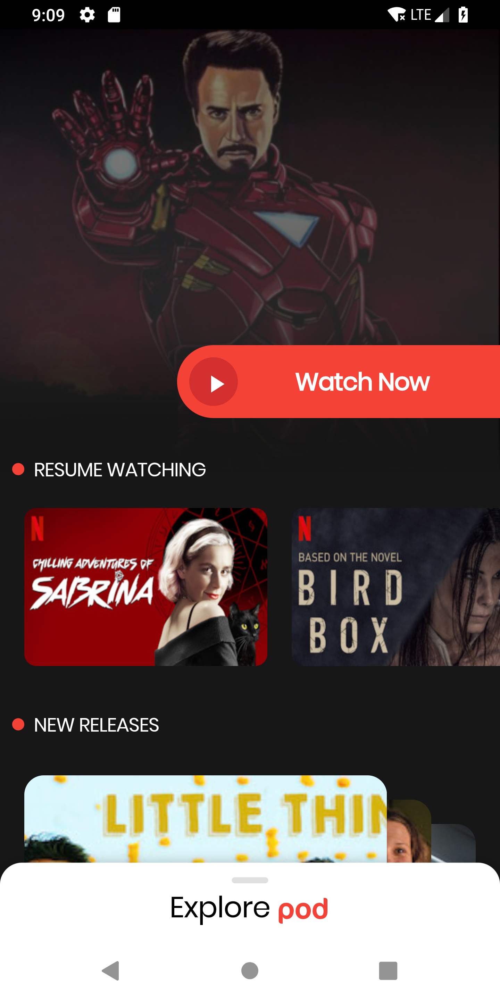
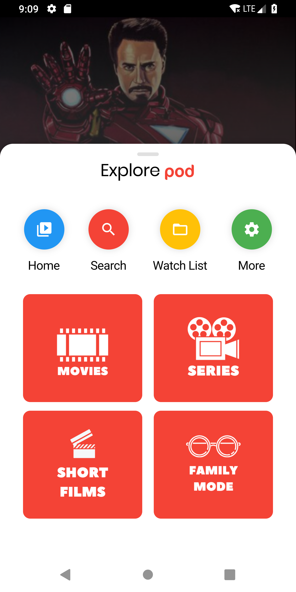
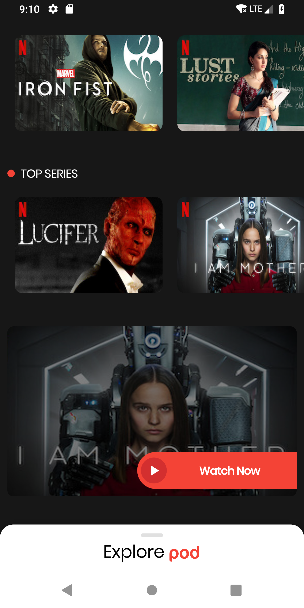
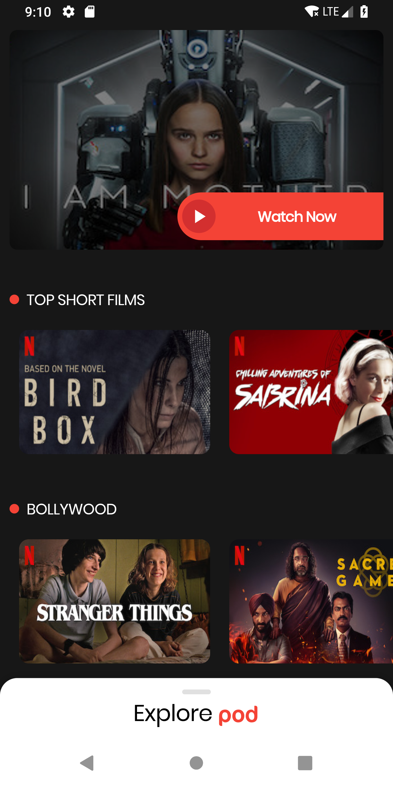
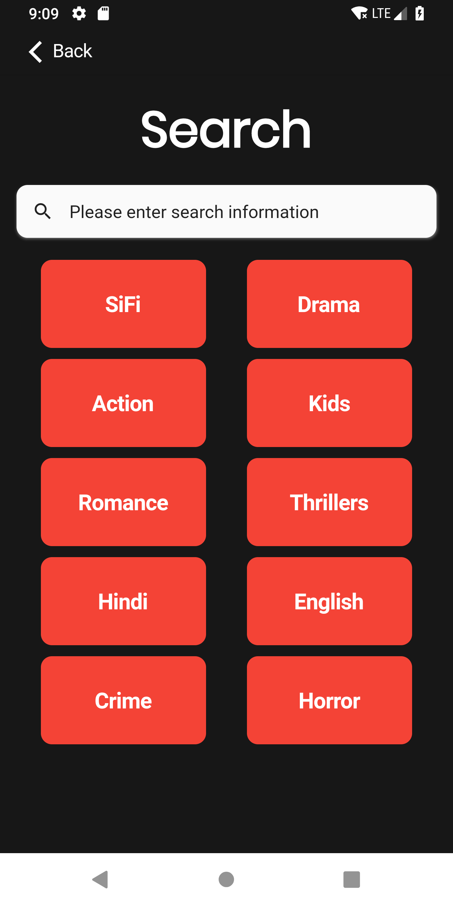
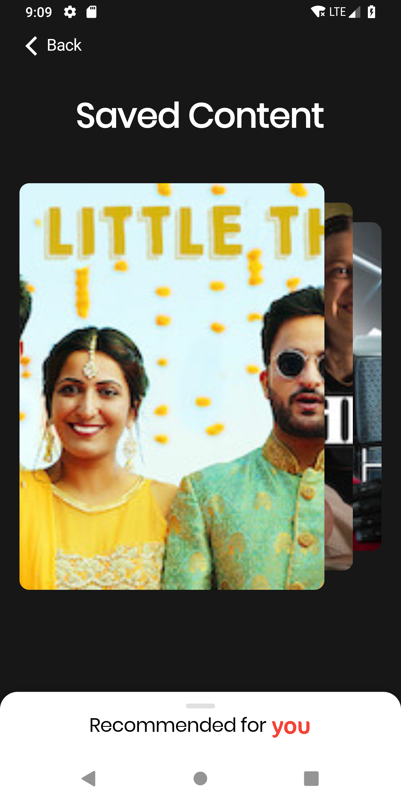
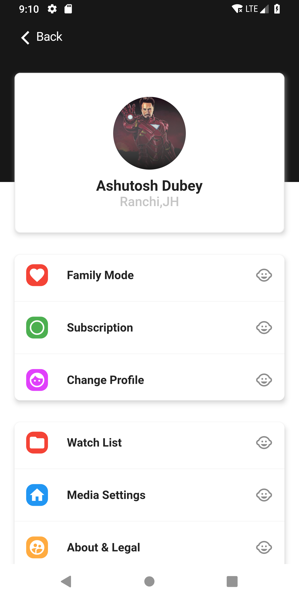
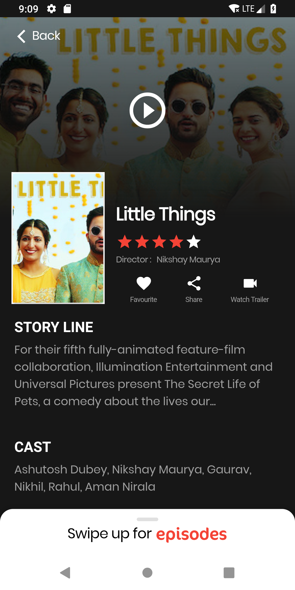
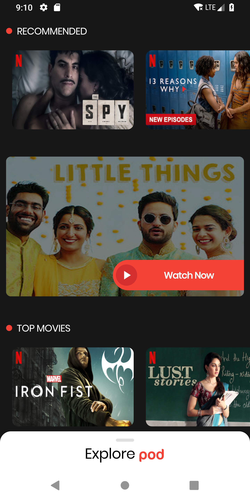

# Media Streaming App

A simple app ui for app to stream movies,shows series and more. 

## Screen Shots

Here are some of the project screen shots.   
   

   

  

## Developer(s)
**Ashutosh Dubey**

## Getting Started

**Note**: Make sure your Flutter environment is setup.
#### Installation

In the command terminal, run the following commands:

    $ git clone https://github.com/idkashutosh/media-streaming-app-ui.git
    $ cd media-streaming-app-ui/
    $ flutter packages get
    $ flutter run

#### Download

If you want to experience podoriginals on your mobile then download the apk from here:

[Download APK](https://github.com/idkashutosh/media-streaming-app/raw/master/app-release.apk)

##### Check out Flutter’s online [documentation](http://flutter.dev/) for help getting started with your Flutter project.
